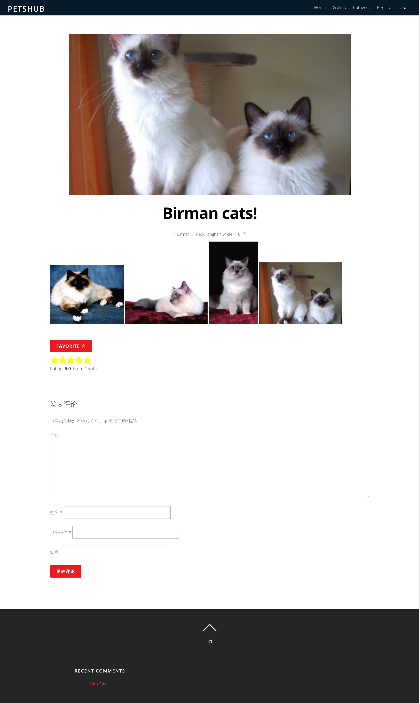
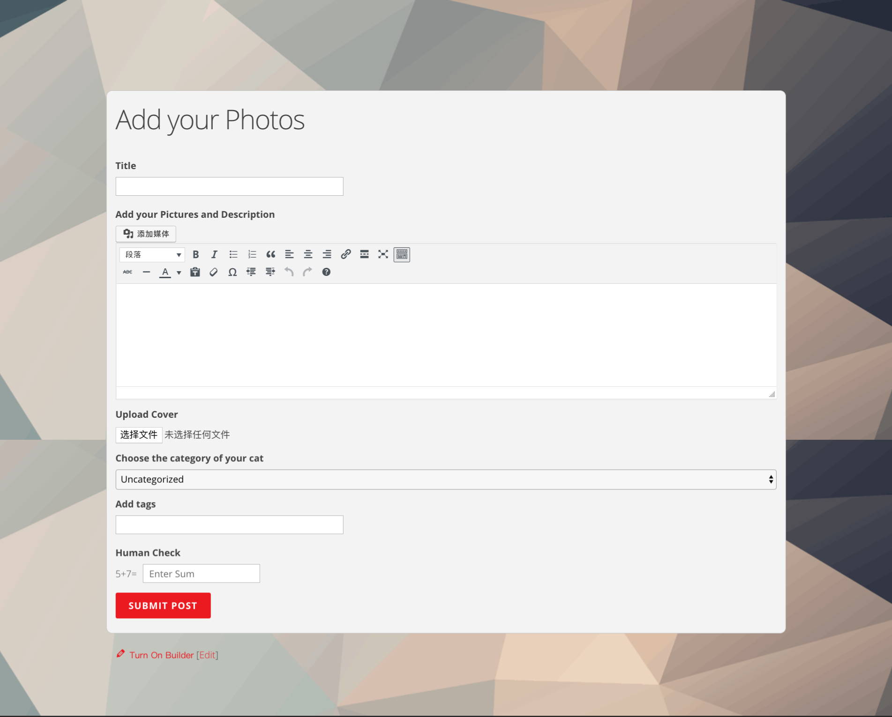
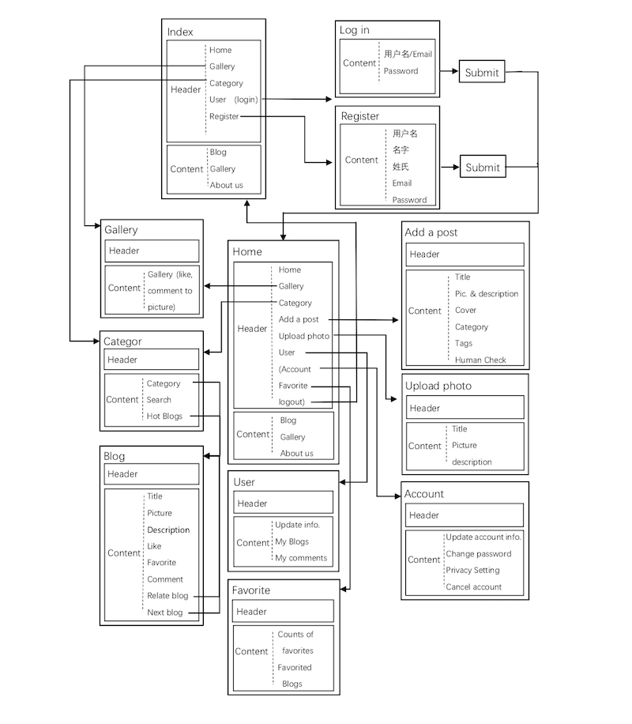
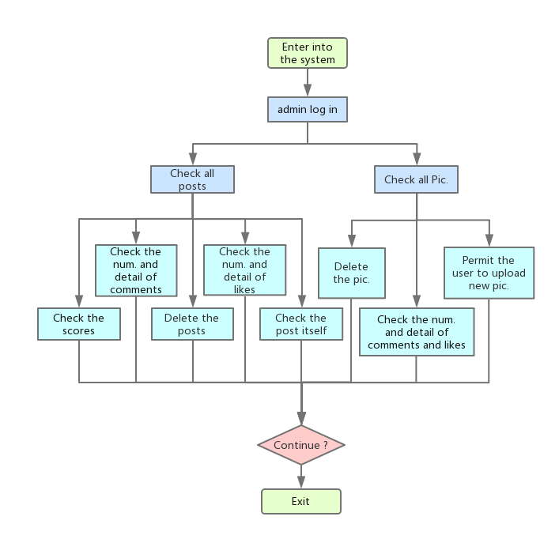
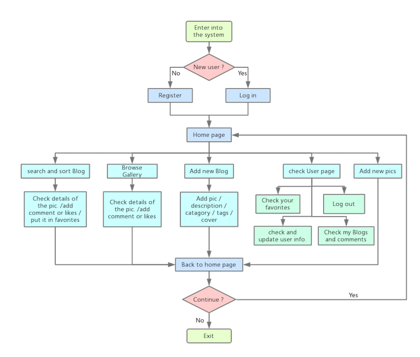
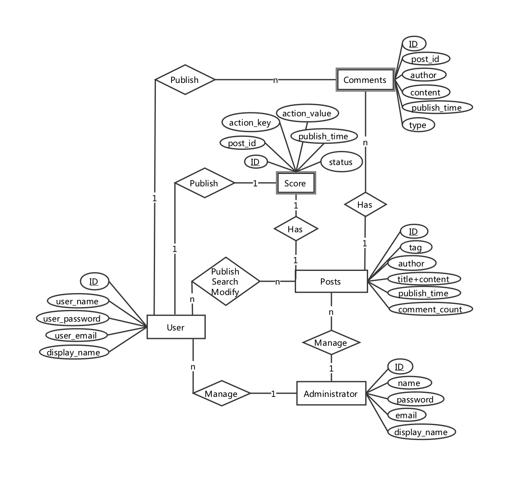

<center></center>


## Discription

[Petshub](139.199.29.220) is a blogging website based on wordpress, aimed at providing a platform for pets lovers to share their stories and communicate with each other. Functions like adding posts, searching and sorting, giving comments and scores, and adding favorites are provided. Although it doesn't have a domain name, you can visit it by clicking [Petshub](139.199.29.220).

## Features

### Functions
####  Cat list managment
- [x] the "BLOG" part on the home page shows the cats list with images and title
- [x] browse the detailed information
####  Sorting support
- [x] the "Catagory" button on the navigation bar will lead you to the sorting page
- [x] click on different cat breeds(shown in bold red letters) to view related posts
- [x] browse the detailed information
#### Searching support
- [x] the "Catagory" button on the navigation bar will lead you to the searching page
- [x] search bar are shown on the right part of the page
- [x] input keywords(cat breeds, post title, cat name,etc.) then searching results are shown on the left side
- [x] click on the "favorite" button under the image to add it into your favorites
####  Detailed information browsing
- [x] view the detail page to vote or give comments by clicking on the cat images
- [x] do it after "Cat list management" and "Sorting support" functions
####  Comments
- [x] give your comment in the "COMMENT" part under the posts
- [x] it is only valid for loggedin users
####  "Like" and "Stars"
- [x] click on the "favorite" button under the posts to add it into your favorites
- [x] fill in different numbers of stars(0-5) to give post a score
####  Score algorithm
- [x] the final mark is given by star rating and semantic recognition of comments 
- [x] detailed algorithm will be shown in "Main Code Block--Automatic scoring system" part
####  Database
- [x] Log into [Petshub Database](139.199.29.220:8081/phpMyAdmin/) with username:1fVa81mZ, and password:k8Tvt4MPtA3V
#### Administration
- [x] Log into [Petshub Dashboard](139.199.29.220/wp-adin) with username:admin, and password:12341234
### Entity-Relationship diagram
the ER diagram will be shown in the "Diagram--ER Diagram" part 
#### Entities
 - User
 - Administrator
 - Post
 - Comment(weak entity)
 - Score(weak entity)
####  Attributes
 - User: <u>ID</u>, user_name, user_password, user_email, display_name
 - Administrator: <u>ID</u>, name, password, email, display_name
  - Post: <u>ID</u>, tag, author, title+content, publish_time, comment_count
  - Comment: <u>ID</u>, post_id, author, content, publish_time, type
  - Score: <u>ID</u>, post_id, action_key, action_value, publish_time, status
  ####  Relationship
  - User(1) - Publish/Search/Modify - Post(n)
  - User(1) - Publish - Score(1)/Comment(n)
  - Post(1） - Has - Score(1)/Comment(n)
  - Administrator(1) - Manage - User(n)/Post(n)
  #### SQL Statements

In wordpress platform, all SQL Statements are generated by the ``$wpdb`` , which contains  **main**  SQL Statements below

### Schema related statements

- Insert function:

```mysql
function _insert_replace_helper( $table, $data, $format = null, $type = 'INSERT' ) {
    $this->insert_id = 0;
 
    if ( ! in_array( strtoupper( $type ), array( 'REPLACE', 'INSERT' ) ) ) {
        return false;
    }
 
    $data = $this->process_fields( $table, $data, $format );
    if ( false === $data ) {
        return false;
    }
 
    $formats = $values = array();
    foreach ( $data as $value ) {
        if ( is_null( $value['value'] ) ) {
            $formats[] = 'NULL';
            continue;
        }
 
        $formats[] = $value['format'];
        $values[]  = $value['value'];
    }
 
    $fields  = '`' . implode( '`, `', array_keys( $data ) ) . '`';
    $formats = implode( ', ', $formats );
 
    $sql = "$type INTO `$table` ($fields) VALUES ($formats)";
 
    $this->check_current_query = false;
    return $this->query( $this->prepare( $sql, $values ) );
}
```

- Connect to the database:

  ```mysql
  public function __construct( $dbuser, $dbpassword, $dbname, $dbhost ) {
      register_shutdown_function( array( $this, '__destruct' ) );
   
      if ( WP_DEBUG && WP_DEBUG_DISPLAY )
          $this->show_errors();
   
      /* Use ext/mysqli if it exists and:
       *  - WP_USE_EXT_MYSQL is defined as false, or
       *  - We are a development version of WordPress, or
       *  - We are running PHP 5.5 or greater, or
       *  - ext/mysql is not loaded.
       */
      if ( function_exists( 'mysqli_connect' ) ) {
          if ( defined( 'WP_USE_EXT_MYSQL' ) ) {
              $this->use_mysqli = ! WP_USE_EXT_MYSQL;
          } elseif ( version_compare( phpversion(), '5.5', '>=' ) || ! function_exists( 'mysql_connect' ) ) {
              $this->use_mysqli = true;
          } elseif ( false !== strpos( $GLOBALS['wp_version'], '-' ) ) {
              $this->use_mysqli = true;
          }
      }
   
      $this->dbuser = $dbuser;
      $this->dbpassword = $dbpassword;
      $this->dbname = $dbname;
      $this->dbhost = $dbhost;
   
      // wp-config.php creation will manually connect when ready.
      if ( defined( 'WP_SETUP_CONFIG' ) ) {
          return;
      }
   
      $this->db_connect();
  }
  ```

  ​

### Customer operation related statemenets

- Get results from database:

  ```mysql
  public function get_results( $query = null, $output = OBJECT ) {
      $this->func_call = "\$db->get_results(\"$query\", $output)";
   
      if ( $this->check_current_query && $this->check_safe_collation( $query ) ) {
          $this->check_current_query = false;
      }
   
      if ( $query ) {
          $this->query( $query );
      } else {
          return null;
      }
   
      $new_array = array();
      if ( $output == OBJECT ) {
          // Return an integer-keyed array of row objects
          return $this->last_result;
      } elseif ( $output == OBJECT_K ) {
          // Return an array of row objects with keys from column 1
          // (Duplicates are discarded)
          foreach ( $this->last_result as $row ) {
              $var_by_ref = get_object_vars( $row );
              $key = array_shift( $var_by_ref );
              if ( ! isset( $new_array[ $key ] ) )
                  $new_array[ $key ] = $row;
          }
          return $new_array;
      } elseif ( $output == ARRAY_A || $output == ARRAY_N ) {
          // Return an integer-keyed array of...
          if ( $this->last_result ) {
              foreach ( (array) $this->last_result as $row ) {
                  if ( $output == ARRAY_N ) {
                      // ...integer-keyed row arrays
                      $new_array[] = array_values( get_object_vars( $row ) );
                  } else {
                      // ...column name-keyed row arrays
                      $new_array[] = get_object_vars( $row );
                  }
              }
          }
          return $new_array;
      } elseif ( strtoupper( $output ) === OBJECT ) {
          // Back compat for OBJECT being previously case insensitive.
          return $this->last_result;
      }
      return null;
  }
  ```

  ​

### Administrator operation related statements

- Delete a row:

  ```Mysql
  public function delete( $table, $where, $where_format = null ) {
      if ( ! is_array( $where ) ) {
          return false;
      }
   
      $where = $this->process_fields( $table, $where, $where_format );
      if ( false === $where ) {
          return false;
      }
   
      $conditions = $values = array();
      foreach ( $where as $field => $value ) {
          if ( is_null( $value['value'] ) ) {
              $conditions[] = "`$field` IS NULL";
              continue;
          }
   
          $conditions[] = "`$field` = " . $value['format'];
          $values[] = $value['value'];
      }
   
      $conditions = implode( ' AND ', $conditions );
   
      $sql = "DELETE FROM `$table` WHERE $conditions";
   
      $this->check_current_query = false;
      return $this->query( $this->prepare( $sql, $values ) );
  }
  ```

  ​

### Webpage Navigation diagram
  ### Page list with description
  -  ##### the diagram of discription will be shown in the "Diagrams--Page Flow" part.
       #### HOME page
     - NAVIGATION bar,providing quik link to other pages
     - WELCOME part
     - BLOG part: showing post images linking to detail page
     - GALLORY part: showing several best images chosen by administrator
     - ABOUT part: some description about the website
     - CONTACT part: information of the authors
       #### Register page
     - some information should be submitted before getting an account
     - user_name, real_name, e-mail_address, password, password_recheck
     - click on "REGISTER" button to move on, click on "LOGIN" button to return
       #### Login page
     - fill in user_name or e-mail_address and password
     - login successfully after identification
       #### Logout page
     - come back to HOME page as a loggedout user
       #### Password reset page
     - fill in old_password, new_password and new_password_recheck
     - reset successfully after identification
       #### Account page
     - show user_description, published posts, and published comments
     - each are linked to related detail page
       #### Favorite page
     - show favorite_count and favorite_list
     - each are linked to related detail page
       #### Category & Searching page
     - left part shows different categories(based on cat breeds)
     - right part shows search bar and recommended posts(based on comment count)
     - description of these two functions are shown in "Functions" part(Sorting support and Searching support)
       #### Add a post page
     - add a title for the post
     - upload images by clicking on the button "ADD MEDIA"
     - add description in the blank area
     - choose a special image as the front cover
     - add a tag for the post
     - fill in the answer of elementary math question for human checking
     - click on the "PUBLLISH" button to submit
     - submitted posts will be shown in the BLOG
       #### Gallery page
     - several images are shown in this page
     - each has a message icon and a star icon
     - click on the icons to give comments and give a "like"
       #### Upload photo page
     - fill in title and description
     - upload images by clicking on the button "CHOOSE FILES"
     - click on the "PUBLLISH" button to submit
     - submitted images will be shown in the GALLERY
### Navigation diagram
the navigation diagram will be shown in the "Diagrams--Transaction Flow Diagram","Diagrams--Administrator", and "Diagrams--User" 
### The skin of our website application
- Wordpress Theme: Themify Ultra(Installation package)
  - set different suitable layouts for different pages
  - choose background images and elegent fonts
  - use the section scrolling function to get dynamic effect
## Screenshots

<center></center>

### Gallery

<center></center>

### Detail

<center></center>

### Add photos

<center></center>

### User

<center></center>

## Tech/framework used

### Platform

- built with [Wordpress](https://wordpress.com/)

### Plugins

- AccessPress Anonymous Post
  - support for Sorting Function
- Contest Gallery
  - support for Gallery Function
- Favorites
  - support for "likes" Function
- GD Rating System
  - support for "Stars" Function
- Themify Portfolio Post
  - support for post type 
- Ultimate Member
  - support for User Information​


## Diagrams
### Page Flow

<center></center>

### Transaction Flow Diagram
#### Administrator

<center></center>

#### User

<center></center>

### ER Diagram

<center></center>

## Main Code Block
### Automatic scoring system
By registering the hook function, when a new comment is generated, it sends the data to the Tencent NLP interface and returns the score, which is stored in the database according to the ``meta_key`` and ``meta_value``: score newly added to the posts. According to the analysis of the contents of the stars in praise, the two scores combined ranking show in the front, the code is as follows:
```php
add_action('comment_post','generate_score');

function generate_score($comment_ID, $comment_approved){
global $wpdb;

if(1 == $comment_approved){//如果评论已经审核
$comment = get_comment($comment_ID);//获取comment对象
$content = $comment->comment_content;//获取content内容
$post_id = $comment->comment_post_ID;//获取帖子ID
//使用sdk连接腾讯云NLP接口
error_reporting(E_ALL ^ E_NOTICE);
require_once './QcloudApi.php';

$config = array('SecretId'        => 'AKIDsb7RaWvoNm13sTf20kGagYCdsuhEcVFj',
'SecretKey'       => 'NULwGK7ev0qlhQu99uQhkYBZifOs7C2d',
'RequestMethod'  => 'POST',
'DefaultRegion'    => 'gz');

$wenzhi = QcloudApi::load(QcloudApi::MODULE_WENZHI, $config);

$package = array("content"=>$content);//将content打包

$a = $wenzhi->TextSentiment($package);//数据包

if ($a === false) {
$error = $wenzhi->getError();
echo "Error code:" . $error->getCode() . ".\n";
echo "message:" . $error->getMessage() . ".\n";
echo "ext:" . var_export($error->getExt(), true) . ".\n";
} else {
$scor = json_decode($a, true);
}
//情感分析打分
$json = $wenzhi->getLastResponse();
$obj = json_decode($json);
$score = $obj->{'negative'} * 100;
wpdb::insert( ‘wp_postmeta’, array( ‘post_id’ => $post_id, ‘meta_key’ => ‘score’, 'meta_value' => $score ), array('%d','%s','%d') );//插入数据库
}
}
```
### Gain score form database:
```php
function get_score( $post_ID ){
$score = $wpdb->get_results("
SELECT 'score' FROM 'wp_postmeta' where 'post_ID'=$_post_ID
");
return $score;
}
```
### Add custom field to the posts:
```SQL
INSERT INTO wp_postmeta (post_id, meta_key, meta_value)
SELECT ID AS post_id, 'score'
AS meta_key '0 AS meta_value
FROM wp_posts WHERE ID NOT IN
(SELECT post_id FROM wp_postmeta WHERE meta_key = 'score')`` AND post_type = 'post';
```

## Links

* [Petshub](139.199.29.220)
* [Admin page](139.199.29.220/wp-admin)
* [Readme.md](https://github.com/nimocat/Petshub/blob/master/petshub.md)
* [Github](https://github.com/nimocat)
* [Project zip](https://github.com/nimocat/Petshub)
